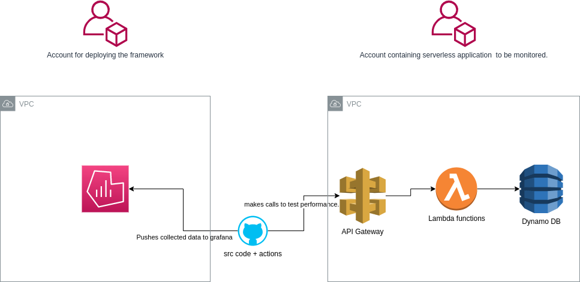
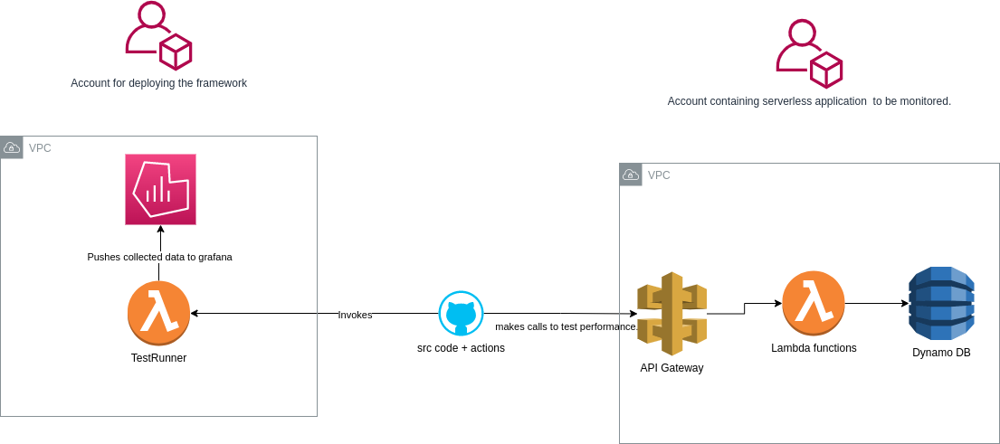
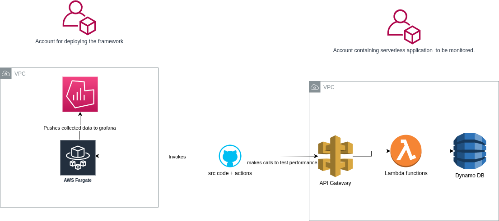

# Description

# Tasks / User stories.

* As a user, I can add functions to be tested
* As a user, I can configure the number of tests
* As a user, I can specify the metrics to be collected
* As a user, I can view different visualizations of the data
* As a user, I expect the franework to test and collect results after every change to any function (i.e Add, delete, update).

# Non technical requirements

* The framework needs to be able to assume a role that allows it to call and test the functions.
* A central admin login and password should be set up to restrict unauthorized access.

# Architecture

## option 1

run tests in github actions

pros:
* No additional overhead

cons:
* Limitations imposed by github actions (e.g. rumtime constraints).
* Tight coupling between the framework and the application.

## option 2

deploy testing logic in lambda and trigger it via webhooks

pros:
* Only billed for the duration of running the tests.
* No infrastructure management overhead.
* Easy to spin up and tear down.

cons:
* Run time limit of 15 minutes, which could be problamatic for huge test sets.

# option 3

Deploy testing logic in fargate.

pros:
* No runtime limit constraint.
* No infrastructure management overhead.

cons:
* Billed during inactive time.

# rough plan (First Draft).
1. let the user input their test configurtion file.
2. let the user define endpoints and pay loads.
3. once deployed, monitor every chnge to a function.
4. Run tests according to configuration after  every change.
5. collect results from cloudwatch, sonarqube and possibly any other testing tool and dump it into a database.
6. Use grafana to display the different results. 
7. [k6](https://k6.io/docs/) can be used to test and collect the different metrics.( inspired by [Microservices vs Serverless: A Performance Comparison on a
Cloud-native Web Application](https://www.scitepress.org/Papers/2020/97927/97927.pdf) )

# Stretch Goals.

1. Add support for different cloud providers (Azure, Google Cloud)
2. Improve security.